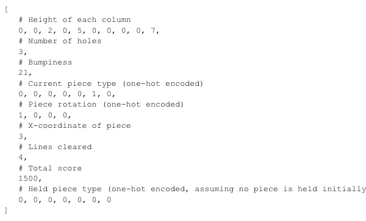
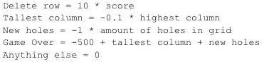

# Tetris-AI

## Index
- [Introduction](#introduction)
- [Background and Concept](#BandC)
- [Requirements](#requirements)
- [Installation](#installation)
- [Usage](#usage)
- [Examples and Screenshots](#EandS)
- [Methodology](#methodology)
- [Results](#results)
- [Limitations](#limitation)
- [Contributions and Acknowledgements](#CandA)
- [License](#license)
- [Contact](#contact)

## Introduction

This project features a Tetris-playing AI developed using Deep-Q-learning in PyTorch. 
The AI demonstrates how reinforcement learning can be applied to classic video games, 
showcasing the effectiveness of machine learning strategies in game playing.

## Background and Concept

This project uses Deep-Q-learning, a form of reinforcement learning, to teach the AI how to play Tetris. 
The concept behind Deep-Q-learning and its suitability for decision-making in Tetris is explored.

## Requirements

- Python 3.8 or higher. 
- PyTorch
- Numpy
- matplotlib.pyplot
- deque from collection

## Installation

To set up the environment, follow these steps:
1. Fork this repo.
2. Open your own forked repo.
3. Clone it to your local computer.

## Usage

To use the Tetris-AI, follow these steps:

### Running the AI
1. Open your terminal or command prompt.
2. Navigate to the directory where the Tetris-AI is located. 
3. Run the AI using the following command. 
4. `python agent.py`
5. This will run the program.

### Configuration
- You can adjust the AI's settings by going `config.py`
- Available options include:
- **Learning Rate**: Controls how quickly the AI adapts to new patterns.
- **Batch Size**: Number of training example used in one iteration of model training.
- **FPS**: How fast the screen refreshes.
- **Gamma**: Discount factor. Determines the importance of future rewards in the AI's decision-making process.

### Interacting with an AI
- Once running, the AI will automatically start playing Tetris.
- You can observe the AI's decision-making in real as it will display each move it makes.
- Or, you can observe from a graph that shows number of games and score, as well as mean score.

### Stopping the AI
To stop the AI, simply close the program window.

## Examples and Screenshots

- Here's the video of AI when it's just started.

- Here's the video of AI around 80 to 150 games.

- Here's the video of AI after 300 games.
...don't have it yet :p

## Methodology

### Overview of Deep-Q-Learning
Deep Q-Learning is an advanced form of the standard Q-Learning algorithm. It's a powerful algorithm that 
combines the decision-making capabilities of Q-Learning with the representational abilities of deep neural networks. 
This image from [Analytics Vidhya](https://www.analyticsvidhya.com/blog/2019/04/introduction-deep-q-learning-python/) explains
the difference between classic Q-Learning and Deep-Q-Learning well.

### Tetris as a Reinforcement Learning Problem
In this project, Tetris is treated as a reinforcement learning problem where each state represents a different 
configuration of the Tetris grid, and each action represents a possible move or rotation of a Tetris piece. 
The AI's objective is to maximize the number of lines cleared.
### State Representation
The state of the Tetris game is represented in a way that the neural network can process. 
This involves flattening the Tetris grid into a vector or using a more complex representation to capture the spatial structure.
Here's the representation of the state.   

### Reward System
The reward system is the following.  

### Challenge and Solution in the Reward System Design
#### The Challenge
The core challenge in designing the reward system for our Tetris-AI was to encourage the AI to focus primarily on clearing lines while also taking into account the overall health of the game board. This involves two key factors:
- **Minimizing the Number of Holes**: Holes (empty spaces where no block is placed) can lead to inefficient space usage and reduce the chances of clearing lines in future moves.
- **Managing the Height of Each Column**: High columns can lead to an increased risk of topping out (reaching the top of the board), which would end the game.

The goal was to create a reward system that not only rewards line clearance but also subtly guides the AI towards maintaining a cleaner, more manageable board.

#### The Solution
To address this challenge, we implemented a dynamic reward system that adapts based on the current state of the game board. The key components of this system are:

1. **Line Clearance Reward**: The AI receives a significant positive reward for clearing lines. This is the primary objective and is thus given the highest weight in the reward system. The reward is proportional to the score, incentivizing the AI to clear multiple lines simultaneously for higher scores.

2. **Penalty for Holes**: The AI incurs a penalty for each hole on the board. This discourages the creation of holes and encourages the AI to play in a way that minimizes them. It's crucial as holes can significantly hinder the AI's ability to clear lines in the future.

3. **Penalty for Column Height**: The AI also receives a penalty based on the height of the tallest column. This ensures that the AI avoids risky strategies that might lead to a quick game-over situation. It encourages the AI to distribute blocks evenly and keep the overall board height low.

By carefully calibrating these rewards and penalties, the AI learns to balance the immediate objective of clearing lines with the longer-term strategy of maintaining a healthy board state. This dual focus enables the AI to achieve higher scores while also demonstrating more strategic and sustainable gameplay.

### Tools and Library used.
- Pygame
- Pytorch
- IPython
- Matplotlib
- Numpy
- PyTorch

## Results

N/A

## Limitation

One notable limitation of this AI is its inability to perform advanced techniques like T-spins or 
specific opening strategies. This restricts its gameplay to more basic maneuvers. This will impact its 
overall effectiveness in complex scenarios.

## Contribution and Acknowledgements

The Tetris game itself is coming from [this repo](https://github.com/vonkez/Tetris-pygame). Thank you 
so much for making such beautiful, yet powerful Tetris Game!!

## License

MIT License Obtained.

## Contact
- Email: masumi76@uw.edu
- Tel: 253-455-9779
