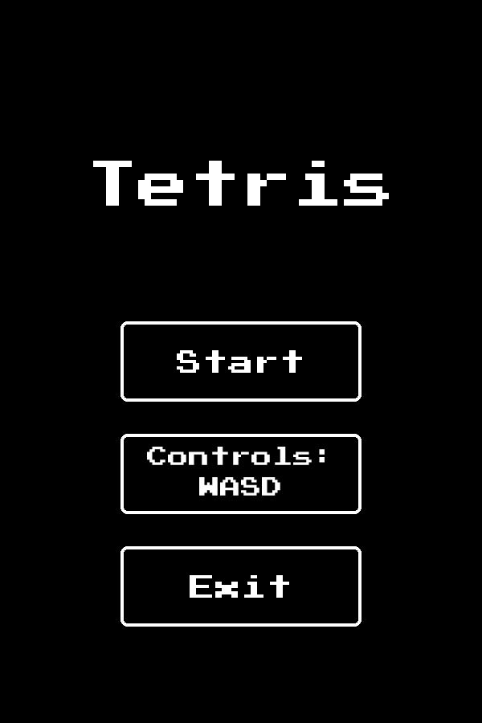
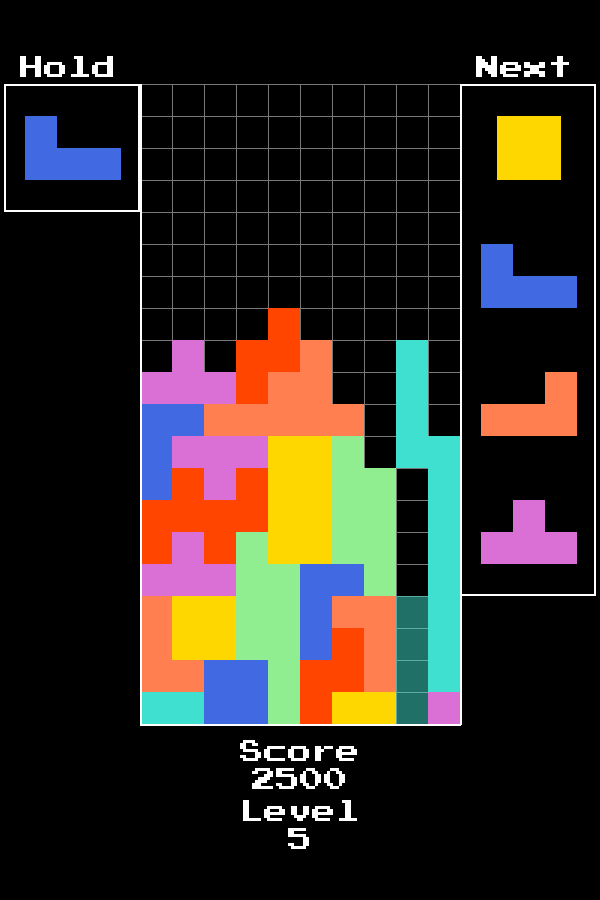

# Tetris Pygame
Simple Tetris game made with Pygame.
It supports [SRS](https://tetris.wiki/Super_Rotation_System), [Ghost piece](https://tetris.wiki/Ghost_piece)
 [Lock delay](https://tetris.wiki/Lock_delay), [Piece preview](https://tetris.wiki/Piece_preview), [Hold](https://tetris.wiki/Hold_piece),
 [7-Bag generator](https://tetris.wiki/Random_Generator), [DAS](https://tetris.wiki/DAS), [Soft/Hard drop](https://tetris.fandom.com/wiki/Drop#Gravity).

## Controls
This game has two control schemes **Guideline** and **WASD**.

|                          | Guideline | WASD       |
|--------------------------|-----------|------------|
| Move Left                | ←         | A          |
| Move Right               | →         | D          |
| Soft Drop                | ↓         | W          |
| Hard Drop                | Space     | S          |
| Hold                     | C         | Left Shift |
| Rotate Clockwise         | ↑         | →          |
| Rotate Counter-clockwise | Z         | ←          |

## Images
 